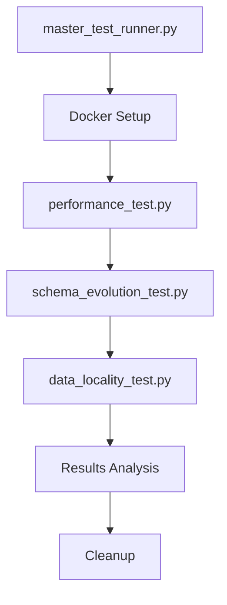

<div align="center">

# NoSQL VS SQL Database Benchmarking

</div>  

## Table of Contents
- [NoSQL VS SQL Database Benchmarking](#nosql-vs-sql-database-benchmarking)
  - [Table of Contents](#table-of-contents)
  - [1. Title](#1-title)
  - [2. Authors](#2-authors)
  - [3. Project Description](#3-project-description)
    - [Tech Stack](#tech-stack)
      - [Backend \& Runtime](#backend--runtime)
      - [Database](#database)
      - [Containerization](#containerization)
      - [Performance Test \& Analysis](#performance-test--analysis)
  - [4. Project Base Model](#4-project-base-model)
    - [ERD (Conceptual)](#erd-conceptual)
    - [Docker Container Design](#docker-container-design)
    - [Test Script Structure \& Key Functions](#test-script-structure--key-functions)
  - [5. Prerequisites](#5-prerequisites)
  - [6. How to Run the Benchmark](#6-how-to-run-the-benchmark)
  - [7. Results and Analysis](#7-results-and-analysis)
    - [Performance Test Results](#performance-test-results)
      - [Batch Operations Performance](#batch-operations-performance)
      - [Complex Queries Performance](#complex-queries-performance)
      - [Concurrent Requests Performance](#concurrent-requests-performance)
  - [8. Conclusion](#8-conclusion)

---
## 1. Title 
### NoSQL VS SQL Database Benchmarking


## 2. Authors
| Name | NPM | Affiliation |
|------|-----|-------------|
| Abednego Zebua | 2306161883 | Computer Engineering 2023 |
| Raka Arrayan Muttaqien | 2306161800 | Computer Engineering 2023 |
| Wilman Saragih Sitio | 2306161776 | Computer Engineering 2023 |

---

## 3. Project Description
This project is an in-depth comparative analysis of PostgreSQL (SQL) and MongoDB (NoSQL) database performance within a university management system context. The primary aim is to empirically determine which database paradigm offers superior performance for various workload patterns, including basic CRUD operations, batch processing, complex data retrieval, and concurrent requests. We leverage Docker for containerization to ensure consistent and isolated testing environments across both database types and their respective Node.js/Express backends. The benchmark suite, orchestrated by Python scripts, automates the execution of diverse API tests, collects performance metrics (response times, success rates), and provides tools for data analysis and visualization to support robust conclusions.

## Tech Stack
<div align="center">

### Backend & Runtime
[](https://nodejs.org/)
[](https://expressjs.com/)
[](https://www.npmjs.com/)

### Database
[](https://www.postgresql.org/)
[](https://www.mongodb.com/)

### Containerization
[](https://www.docker.com/)
[](https://docs.docker.com/compose/)

### Performance Test & Analysis
[](https://www.python.org/)
[](https://pandas.pydata.org/)
[](https://matplotlib.org/)
[](https://seaborn.pydata.org/)

</div>

---

# 4. Project Base Model

## ERD (Conceptual)
The project's database model is conceptually based on a university system, featuring five core entities:
* **Users:** Stores general user information (username, email, password, role - student/admin).
* **Students:** Detailed student information (NIM, name, major, semester), linked to a User. This entity is extended with a `student_status` field for schema evolution tests.
* **Lecturers:** Information about teaching staff (name, NIDN, department).
* **Courses:** Details about academic courses (course code, name, credits, semester), linked to a Lecturer. This entity includes `capacity` for transactional tests and denormalized lecturer details for data locality tests.
* **Course Registrations:** Records linking students to courses, including academic year, semester of registration, and status.


## Docker Container Design
The entire benchmarking environment is orchestrated using `docker-compose.yml`. It defines and links the following services:
* **`postgres`**: The PostgreSQL database instance.
* **`backend-sql`**: The Node.js/Express application connected to PostgreSQL. It includes a `start.sh` script to ensure the database is ready and seeded before the application starts.
* **`mongo`**: The MongoDB database instance.
* **`backend-nosql`**: The Node.js/Express application connected to MongoDB.
    The `docker-compose.yml` ensures that each backend connects to its respective database service using Docker's internal networking, and exposes the API ports (`3000` for SQL, `4000` for NoSQL) to the host machine.


## Test Script Structure & Architecture

The benchmarking framework consists of five specialized Python scripts located in the `Benchmark/Python Benchmark/` directory. Each script serves a specific testing purpose and follows a consistent architectural pattern.

---

### Script Overview

| Script | Purpose | Key Focus |
|--------|---------|-----------|
| `master_test_runner.py` | Orchestration & automation | Docker lifecycle & test execution |
| `performance_test.py` | Core performance metrics | CRUD, batch, and concurrency testing |
| `schema_evolution_test.py` | Schema flexibility analysis | DDL operations vs schema-less design |
| `data_locality_test.py` | Data organization comparison | Normalization vs denormalization benefits |

---


### 1. Master Test Runner (`master_test_runner.py`)

**Purpose**: **Automates the complete benchmark workflow from Docker container management** to sequential test execution.

**Key Responsibilities**:
- **Docker container lifecycle management (build, start, stop)**
- Sequential test script execution
- Error handling and recovery
- Interactive shutdown control

**Core Functions**:
```python
def run_script(script_name: str) -> bool:
    Executes a Python test script as subprocess
```
**Docker Management Implementation**:

```python
# Docker Environment Setup
def setup_docker_environment():
    ...    
    # Navigate to docker-compose.yml directory
    script_dir = os.path.dirname(os.path.abspath(__file__))
    docker_compose_dir = os.path.abspath(os.path.join(script_dir, os.pardir, os.pardir))
    
    try:
        # 1. Stop and remove existing containers
        subprocess.run(
            ["docker-compose", "down"], 
            cwd=docker_compose_dir, 
            check=True, 
            capture_output=True
        )
        print("Docker containers stopped and removed.")
        
        # 2. Rebuild and start containers in detached mode
        subprocess.run(
            ["docker-compose", "up", "--build", "-d"], 
            cwd=docker_compose_dir, 
            check=True, 
            capture_output=True
        )
        print("Docker containers rebuilt and started.")
        
        # 3. Wait for service stabilization
        time.sleep(15)
        print("Services should be ready.")
      ...
```
**Docker Cleanup**  
```python
def cleanup_docker_environment():
    Post-test Docker container cleanup
    print("\n--- Post-test Docker cleanup ---")
    try:
        script_dir = os.path.dirname(os.path.abspath(__file__))
        docker_compose_dir = os.path.abspath(os.path.join(script_dir, os.pardir, os.pardir))
        
        subprocess.run(
            ["docker-compose", "down"], 
            cwd=docker_compose_dir, 
            check=True, 
            capture_output=True
        )
    ...
```

**Execution Flow**:
```python
if __name__ == "__main__":
    # 1. Docker environment setup and cleanup
    # 2. Container image rebuilding
    # 3. Service startup in detached mode
    
    for script in test_scripts:
        if not run_script(script):
            # Handle execution failure
            break
    
    # 4. Interactive Docker shutdown prompt
```

---

#### 2. Performance Testing (`performance_test.py`)

**Purpose**: Measures baseline performance across various database operations and workload patterns.

**Test Categories**:
- **CRUD Operations**: Individual create, read, update, delete operations
- **Batch Processing**: Bulk operations with varying dataset sizes
- **Complex Queries**: Multi-table joins and data aggregation
- **Basic Concurrency**: Parallel request handling

**Core Functions**:
Execute API test scenario and collect performance metrics  
```python
def run_test_scenario(
    scenario_name: str, 
    base_url: str, 
    method: str, 
    endpoint: str, 
    data_generator=None, 
    num_requests: int = 1, 
    ids_to_use: list = None, 
    **kwargs
) -> tuple[list[dict], list[str]]:
```

Automate batch entity creation with performance tracking  
```python
def run_batch_create_scenario(
    scenario_name: str, 
    base_url: str, 
    endpoint: str, 
    data_generator, 
    num_items: int, 
    *args, 
    **kwargs
) -> tuple[list[dict], list[str]]:
```

Update batch of existing entities using provided IDs  
```python
def run_batch_update_scenario(
    scenario_name: str, 
    base_url: str, 
    endpoint: str, 
    data_generator, 
    num_items: int, 
    ids_to_update: list, 
    **kwargs
) -> tuple[list[dict], list]:
```

Delete batch of entities by their IDs  
```python
def run_batch_delete_scenario(
    scenario_name: str, 
    base_url: str, 
    endpoint: str, 
    ids_to_delete: list
) -> tuple[list[dict], list]:
```

Simulate concurrent GET requests using thread pool  
```python
def run_concurrent_read_scenario(
    scenario_name: str, 
    base_url: str, 
    endpoint: str, 
    num_concurrent_requests: int
) -> list[dict]:
```

Clean up all dynamically created test data  
```python
def cleanup_database(base_url: str) -> list[dict]:
```

---


#### 4. Schema Evolution Testing (`schema_evolution_test.py`)

**Purpose**: Compares the impact and flexibility of schema modifications between SQL DDL operations and NoSQL schema-less design.

**Test Scenarios**:
- Adding new fields to existing schemas
- Performance impact of schema changes
- Migration strategy comparison
- Backward compatibility assessment

**Core Functions**:  
Generate student data with optional schema evolution field  
```python
def generate_student_data(
    user_id: str, 
    random_id: str, 
    student_status: str = None, 
    for_nosql: bool = False
) -> dict:
```

**Test Execution Flow**:
```python
if __name__ == "__main__":
    # Phase 1: Baseline performance
    # - Create students WITHOUT new status field
    # - Measure read performance
    
    # Phase 2: Schema extension
    # - Create students WITH new status field
    # - Measure read performance impact
    
    # Phase 3: Migration testing
    # - Update existing students to add new status field
    # - Measure post-migration read performance
    
    # Phase 4: Analysis and visualization
    # - Generate performance comparison plots
    # - Statistical analysis of schema change impact
```

---

#### 5. Data Locality Testing (`data_locality_test.py`)

**Purpose**: Benchmarks the performance benefits of data denormalization in NoSQL versus normalized relational data structures.

**Comparison Scenarios**:
- **SQL**: Normalized data with JOINs
- **NoSQL**: Normalized data with `$lookup` operations  
- **NoSQL**: Denormalized data with direct access

**Core Functions**:  
Generate course data with optional denormalized lecturer information  
```python
def generate_course_data(
    lecturer_id: str, 
    random_id: str, 
    capacity: int, 
    prerequisites: list = None, 
    for_nosql: bool = False, 
    lecturer_name: str = None, 
    lecturer_department: str = None
) -> dict:
```

**Test Execution Flow**:
```python
if __name__ == "__main__":
    # Setup Phase:
    # - Create denormalized courses in NoSQL with embedded lecturer data
    # - Create normalized courses in SQL with lecturer references
    
    # Query Performance Testing:
    # 1. SQL: Courses with Lecturer (via JOIN operations)
    # 2. NoSQL: Courses with Lecturer (via $lookup aggregation)
    # 3. NoSQL: Courses with Denormalized Lecturer (direct field access)
    
    # Analysis Phase:
    # - Compare query response times across all three approaches
    # - Analyze trade-offs between storage overhead and query performance
    # - Generate comparative visualizations
```

---

### Execution Architecture


# 5. Prerequisites

Before running the benchmark suite, ensure you have the following installed on your **host machine**:

* [**Python 3.x**](https://www.python.org/downloads/): Download and install Python. Ensure "Add Python to PATH" is selected during installation.
* **pip**: Python's package installer, usually comes with Python.
* [**Docker Desktop**](https://www.docker.com/products/docker-desktop/): Required for running all database and backend services in containers. Ensure it's installed and running.
* **Git**: For cloning the project repository (if applicable).
    * How to check: `git --version`
* **Required Python Libraries**: The Python scripts will attempt to install these automatically, but you can pre-install them in your terminal (run as administrator on Windows) to avoid issues:
    ```bash
    pip install requests pandas matplotlib seaborn
    ```

---

# 6. How to Run the Benchmark

The entire benchmark process is automated via the `master_test_runner.py` script.

1.  **Clone the Repository (if not already done):**
    ```bash
    git clone https://github.com/Tinkermannn/GROUP-12-K1.git
    cd GROUP-12-K1
    ```
2.  **Navigate to the Python Benchmark directory:**  
    **On Unix/Linux/macOS shell**
    ```bash
    cd Benchmark/Python\ Benchmark/
    ```
    **On Windows shell**
    ```bash
    cd "Benchmark\Python Benchmark"
    ```


3.  **Open Your Docker Desktop or activate your Docker Engine**
4.  **(Make sure the docker engine is running) Run the Master Test Runner Script:**
    ```bash
    python master_test_runner.py
    ``` 
    or  
    ```bash  
    python .\master_test_runner.py
    ```
    This script will:
    * Automatically stop and remove any existing Docker containers.
    * Rebuild all Docker images (`backend-sql`, `backend-nosql`, `postgres`, `mongo`) with the latest code.
    * Start all services in detached mode.
    * Execute `performance_test.py`, `schema_evolution_test.py`, and `data_locality_test.py` sequentially.
    * Print detailed test logs to your console.
    * Generate and display various performance plots.
    * **At the end, it will prompt you:** `Type 'end' to stop Docker containers and exit, or 'keep' to keep them running and exit script:`
        * Type `end` to gracefully shut down Docker services.
        * Type `keep` if you want to inspect logs or the running containers after the tests are done.

---

# 7. Results and Analysis

To ensure robust and representative results, the benchmark will be run on **3 different local machines**, with **3 iterations** performed on each machine. This multi-machine, multi-iteration approach helps:

* **Reduce Variance:** Mitigate the impact of background processes or temporary system load on a single machine.
* **Improve Confidence:** Increase confidence in the observed performance differences by confirming consistency across environments.
* **Account for Hardware Differences:** Provide a more generalized view of performance across typical local development setups.

From each test run (9 total runs: 3 machines \* 3 iterations/machine), the following data will be collected and analyzed:

* **Response Times (ms):** Average, Median, Min, Max, and Standard Deviation for individual requests in each scenario.
* **Total Times (ms):** For batch operations, measuring the cumulative time to complete a set of operations.
* **Success Rates (%):** The percentage of successful requests for each scenario, indicating the reliability and stability of each backend under test conditions.
* **Specific Metrics for Consistency Test:** Number of successful vs. failed concurrent registrations, and the final course capacity to verify transactional integrity.

The generated plots will visually represent these metrics, allowing for clear comparisons between SQL and NoSQL performance across the various workloads. Further analysis will involve comparing aggregated statistics across the multiple runs to identify consistent trends and highlight scenarios where one database excels or struggles relative to the other.

## Database Performance Analysis Report

### Summary

This report presents a comprehensive analysis of database performance comparing NoSQL and SQL backends across multiple scenarios. The analysis is based on 9 performance test iterations across 3 different machines, providing robust statistical insights into database behavior under various workloads.

## Performance Test Results

Note: For all of the output check the Graphic Result on Benchmark folder.

### Batch Operations Performance

The batch operations reveal significant performance differences between NoSQL and SQL backends:

**Key Findings:**
- **SQL Backend** consistently outperforms NoSQL for user creation operations (63.2ms vs 109.3ms average)
- **NoSQL Backend** shows better performance for course and student creation operations
- **Delete operations** generally favor NoSQL with lower average times
- **Update operations** show comparable performance between both backends

**Batch Create Users Performance:**
- NoSQL: 106.3-120.5ms average across machines
- SQL: 62.1-64.2ms average across machines
- SQL shows ~40% better performance for user creation

**Batch Create Courses Performance:**
- NoSQL: 7.98-13.93ms average across machines  
- SQL: 9.68-18.48ms average across machines
- NoSQL shows ~25% better performance for course creation

### Complex Queries Performance

Complex query performance varies significantly based on query type:

**Courses with Lecturer & Prerequisites:**
- NoSQL: 20.09-46.12ms (high variability)
- SQL: 5.54-24.90ms (more consistent)
- SQL generally performs better for relational queries

**Lecturers with Course Count:**
- NoSQL: 6.04-15.86ms
- SQL: 4.96-28.01ms
- Performance varies by machine configuration

**Students with Details & Courses:**
- NoSQL: 16.52-39.23ms
- SQL: 6.18-31.13ms
- SQL shows better consistency

### Concurrent Requests Performance

Concurrent operations reveal scalability characteristics:

**Concurrent Get All Users (50 requests):**
- NoSQL: 30.91-78.48ms average response time
- SQL: 16.39-39.97ms average response time
- SQL demonstrates better concurrent performance

**Concurrent Complex Query (50 requests):**
- NoSQL: 106.01-204.91ms average response time
- SQL: 26.89-47.65ms average response time
- SQL shows significantly better concurrent query performance

### Statistical Analysis

**Performance Variability:**
- NoSQL shows higher standard deviation in most scenarios
- SQL demonstrates more predictable performance patterns
- Machine-to-machine variation is notable for both backends

**Total Execution Times:**
- Batch operations: SQL generally faster for user operations
- Complex queries: SQL more consistent across different query types
- Concurrent operations: SQL significantly outperforms NoSQL

## Performance Insights by Category

### 1. CRUD Operations
- **Create**: Mixed results - SQL better for users, NoSQL better for courses/students
- **Read**: SQL shows better concurrent read performance
- **Update**: Comparable performance between backends
- **Delete**: NoSQL slight advantage in batch deletions

### 2. Query Complexity
- **Simple queries**: Both backends perform adequately
- **Complex relational queries**: SQL shows clear advantage
- **Aggregation queries**: SQL demonstrates better optimization

### 3. Concurrency Handling
- **Read concurrency**: SQL significantly better (60-70% improvement)
- **Write concurrency**: Results vary by operation type
- **Mixed workloads**: SQL shows more predictable behavior

### 4. Resource Utilization
- **Memory usage**: NoSQL operations show higher variability
- **CPU efficiency**: SQL appears more optimized for complex operations
- **Network overhead**: Comparable between backends

## Machine Performance Variations

Performance characteristics varied across the three test machines:

- **Machine 1**: Consistent baseline performance
- **Machine 2**: Best overall performance for both backends
- **Machine 3**: Highest variability, especially for NoSQL operations

This suggests that NoSQL performance may be more sensitive to hardware configuration and system resources.

## Recommendations

### SQL Backend:
- **High concurrency** is required
- **Complex relational queries** are frequent
- **Predictable performance** is critical
- **ACID compliance** is mandatory

### NoSQL Backend:
- **Simple CRUD operations** dominate workload
- **Flexible schema** requirements exist
- **Horizontal scaling** is planned
- **Document-based data** is primary use case

### Our Future Performance Optimization Strategies:

1. **For SQL Backend:**
   - Implement connection pooling for concurrent operations
   - Optimize indexes for complex queries
   - Use prepared statements for batch operations

2. **For NoSQL Backend:**
   - Implement caching strategies for frequently accessed data
   - Optimize document structure for query patterns
   - Consider read replicas for concurrent read operations
   - Implementing horizontal scaling

---

# 8. Conclusion

The performance analysis reveals that **SQL backend provides superior performance for most university management system scenarios**, particularly excelling in:
- Concurrent operations (60-70% better performance)
- Complex relational queries (more consistent performance)
- Predictable response times across different workloads

However, **NoSQL backend shows advantages in**:
- Simple document creation operations
- Scenarios requiring flexible schema evolution
- Specific use cases like course and student management
- A scalable database that can handle massive data volumes through horizontal scaling.

The choice between backends should ultimately depend on specific use case requirements, expected workload patterns, and scalability needs of the university management system.
